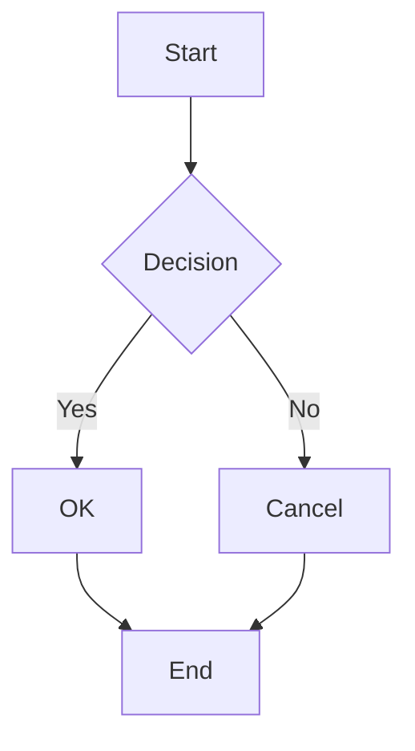
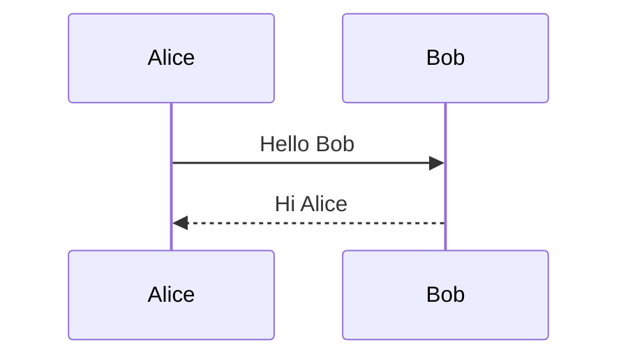

# GFM Full Compliance Test

## 1. Headings

# Heading 1
## Heading 2
### Heading 3
#### Heading 4
##### Heading 5
###### Heading 6

## 2. Text Styling

**Bold text** and __also bold__

*Italic text* and _also italic_

***Bold and italic***

~~Strikethrough text~~

This is <sub>subscript</sub> and <sup>superscript</sup>

This is <ins>underlined</ins> text

## 3. Blockquotes

> Single blockquote

> Multi-line blockquote
> continues here

> Nested blockquote
> > Inner quote
> > > Deeper quote

## 4. Code

Inline `code` here.

```swift
func greet(name: String) -> String {
    return "Hello, \(name)!"
}
```

```python
def greet(name):
    return f"Hello, {name}!"
```

```javascript
const greet = (name) => `Hello, ${name}!`;
```

```java
public class Main {
    public static void main(String[] args) {
        System.out.println("Hello, World!");
    }
}
```

```php
<?php
function greet(string $name): string {
    return "Hello, {$name}!";
}
echo greet("World");
```

```rust
fn main() {
    let name = "World";
    println!("Hello, {}!", name);
}
```

```cpp
#include <iostream>
#include <string>

int main() {
    std::string name = "World";
    std::cout << "Hello, " << name << "!" << std::endl;
    return 0;
}
```

```c
#include <stdio.h>

int main(void) {
    printf("Hello, %s!\n", "World");
    return 0;
}
```

```go
package main

import "fmt"

func main() {
    name := "World"
    fmt.Printf("Hello, %s!\n", name)
}
```

```ruby
def greet(name)
  "Hello, #{name}!"
end

puts greet("World")
```

```typescript
function greet(name: string): string {
    return `Hello, ${name}!`;
}
console.log(greet("World"));
```

```kotlin
fun main() {
    val name = "World"
    println("Hello, $name!")
}
```

```sql
SELECT u.name, COUNT(o.id) AS order_count
FROM users u
LEFT JOIN orders o ON u.id = o.user_id
WHERE u.created_at > '2024-01-01'
GROUP BY u.name
HAVING COUNT(o.id) > 5
ORDER BY order_count DESC;
```

```bash
#!/bin/bash
name="World"
echo "Hello, ${name}!"
for i in {1..5}; do
    echo "Count: $i"
done
```

```yaml
server:
  host: localhost
  port: 8080
  database:
    url: postgresql://localhost:5432/mydb
    pool_size: 10
```

```json
{
  "name": "mods",
  "version": "1.0.0",
  "dependencies": {
    "cmark-gfm": "^0.29.0"
  }
}
```

```
Plain code block
No language specified
```

## 5. Links

[Basic link](https://github.com)

[Link with title](https://github.com "GitHub")

https://github.com (autolink)

## 6. Images


## 7. Unordered Lists

- Item 1
- Item 2
- Item 3

* Star style
* Star item 2

Nested:

- Parent
  - Child 1
    - Grandchild
  - Child 2
- Parent 2

## 8. Ordered Lists

1. First
2. Second
3. Third

Nested:

1. First
   1. Sub first
   2. Sub second
2. Second

## 9. Task Lists

- [x] Completed
- [ ] Incomplete
- [x] Also completed

## 10. Tables

| Left | Center | Right |
|:-----|:------:|------:|
| L1   |   C1   |    R1 |
| L2   |   C2   |    R2 |
| L3   |   C3   |    R3 |

## 11. Horizontal Rules

---

***

___

## 12. Footnotes

Here is a footnote reference[^1] and another[^note].

[^1]: This is the first footnote.
[^note]: This is another footnote.

## 13. Alerts

> [!NOTE]
> Useful information that users should know.

> [!TIP]
> Helpful advice for doing things better.

> [!IMPORTANT]
> Key information users need to know.

> [!WARNING]
> Urgent info that needs immediate attention.

> [!CAUTION]
> Advises about risks or negative outcomes.

## 14. Escaped Characters

\*Not italic\*

\# Not a heading

\[Not a link\](url)

## 15. Line Breaks

First line
Second line (two spaces before newline)

## 16. HTML Inline

<kbd>Ctrl</kbd> + <kbd>C</kbd>

<details>
<summary>Click to expand</summary>

This is hidden content.

</details>

## 17. Mixed Inline

Paragraph with **bold**, *italic*, `code`, ~~strike~~, [link](https://example.com), and a footnote[^1].

## 18. Emoji (GitHub extension)

:smile: :rocket: :+1:

## 19. Math (GitHub extension)

Inline math: $E = mc^2$

Block math:

$$
\sum_{i=1}^{n} x_i = x_1 + x_2 + \cdots + x_n
$$

## 20. Color Chips (GitHub extension)

`#0969DA` `rgb(9, 105, 218)` `hsl(212, 92%, 45%)`

## 21. Mermaid Diagrams (GitHub extension)




